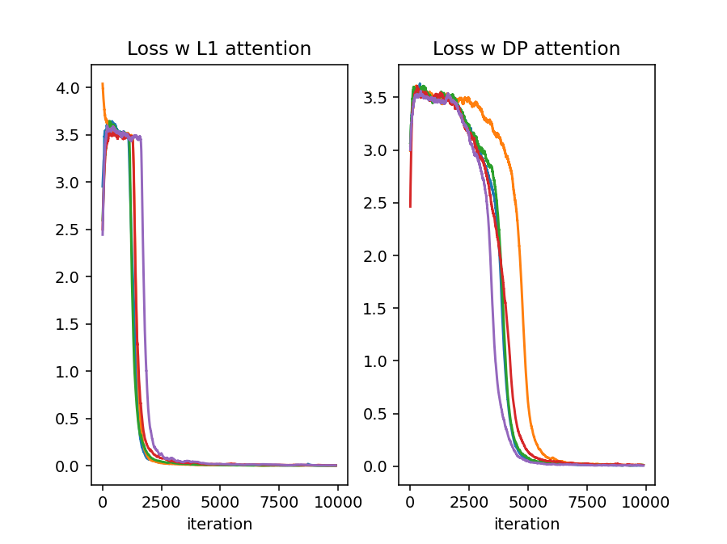
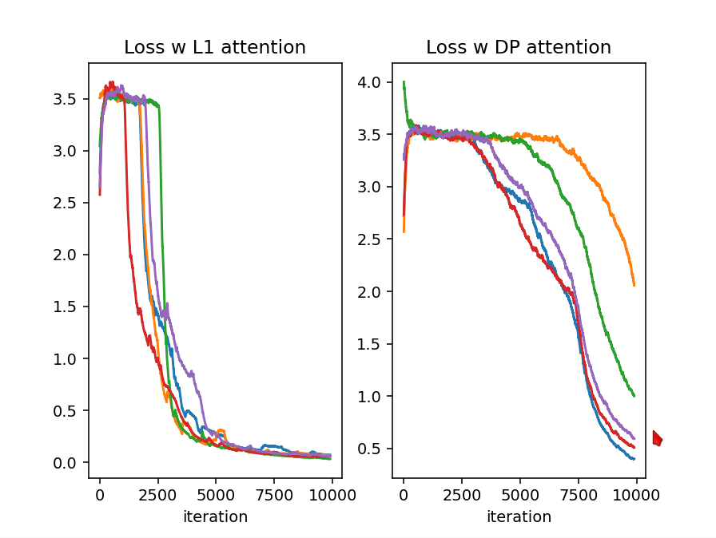
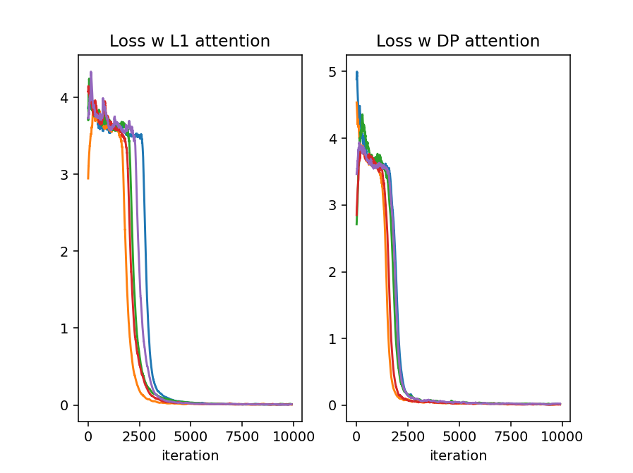
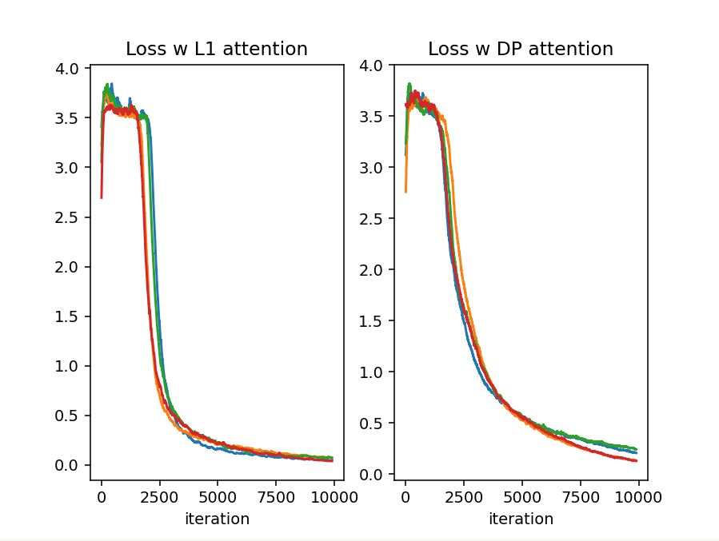

# Synthetic L1 attention test

The toy task is to measure the distance between two matching tokens in a input context.  
Tokens are defined by vectors of random floats [0 .. 0.5); position is encoded *linearly* - e.g. integers 0,1,2.. -- nothing fancy or unnecessary.

We use this slightly difficult toy test to compare the convergence properties of the two types of attention, all other parameters / hyperparameters held fixed.  

With LayerNorm **off** and **two** layers, L1 attention converges faster than dot-product attention: 

With LayerNorm **off** and **one** layer, L1 attention converges faster: 

With LayerNorm **on** and **two** layers, DP is faster. (This is also the slowest / highest compute configuration.)

With LayerNorm **on** and **one** layer, L1 is slightly better than DP. 

Execution speed is similar for both L1 and DP attention using the CUDA implementation here. 
Models are a good bit faster with LN off, obviously -- but likely  will need some other way of regularizing activity in larger models.  TBD! 
